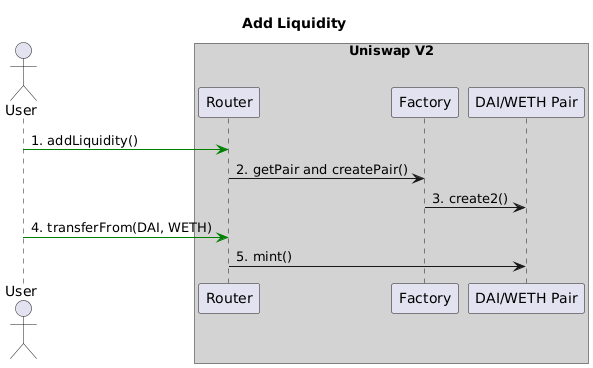

# Swap

## GetAmountsOut Function:

The getAmountsOut function inside the Uniswap V2 Library in Uniswap V2 Router contract.
At the bottom of the Uniswap V2 Router contract, you will see two functions: getAmountsOut and getAmountsIn.

The getAmountsOut function plays a crucial role in Uniswap V2, enabling users to calculate the potential outcomes of swaps and make informed trading decisions.

### Arguments:

- factory: The Uniswap factory contract. This contract is used to create and manage the liquidity pools for the different tokens on Uniswap.
- amountIn: The amount of the initial token we're starting with.
- path: The list of tokens involved in the swap. In our example, this is [WETH, DAI, MKR].

```solidity
// performs chained getAmountOut calculations on any number of pairs
// NOTE: amounts[0] = amountIn
//       amounts[n - 1] = final amount out
//       amounts[i] = intermediate amounts out
function getAmountsOut(address factory, uint amountIn, address[] memory path) internal view returns (uint[] memory amounts) {
    require(path.length >= 2, 'UniswapV2Library: INVALID_PATH');
    amounts = new uint[](path.length);
    amounts[0] = amountIn;
​
    // NOTE: Example
    // --- Inputs ---
    // amountIn = 1e18
    // path = [WETH, DAI, MKR]
    // --- Outputs ---
    // WETH    1000000000000000000 (1 * 1e18)
    // DAI  2500339748620145970214 (2500.3397... * 1e18)
    // MKR     1242766501542703043 (1.2427... * 1e18)
​
    // --- Execution ---
    // amounts = [0, 0, 0]
    // amounts = [1000000000000000000, 0, 0]
​
    // For loop
    // i = 0
    // path[i] = WETH, path[i + 1] = DAI
    // amounts[i] = 1000000000000000000
    // amounts[i + 1] = 2500339748620145970214
    // amounts = [1000000000000000000, 2500339748620145970214, 0]
​
    // i = 1
    // path[i] = DAI, path[i + 1] = MKR
    // amounts[i] = 2500339748620145970214
    // amounts[i + 1] = 1242766501542703043
    // amounts = [1000000000000000000, 2500339748620145970214, 1242766501542703043]
​
    // NOTE:
    //   i | path[i]   | path[i + 1]
    //   0 | path[0]   | path[1]
    //   1 | path[1]   | path[2]
    //   2 | path[2]   | path[3]
    // n-2 | path[n-2] | path[n-1]
    for (uint i; i < path.length - 1; i++) {
        // NOTE: reserves = internal balance of tokens inside pair contract
        (uint reserveIn, uint reserveOut) = getReserves(factory, path[i], path[i + 1]);
        // NOTE: use the previous output for input
        amounts[i + 1] = getAmountOut(amounts[i], reserveIn, reserveOut);
    }
}

// given an input amount of an asset and pair reserves, returns an equivalent amount of the other asset
function getAmountOut(uint amountIn, uint reserveIn, uint reserveOut) internal pure returns (uint amountOut) {
    require(amountIn > 0 && reserveIn > 0 && reserveOut > 0, 'UniswapV2Library: INSUFFICIENT_INPUT_AMOUNT');
    // NOTE:
    // x = token in
    // y = token out
    // dx = amountIn * 997 / 1000
    // dy = dx * 997 / 1000 * yo
    // ----------
    // xo * 1000 + dx * 997
    // NOTE: dx * 997
    uint amountInWithFee = amountIn.mul(997);
    // NOTE: dx * 997 * yo
    uint numerator = amountInWithFee.mul(reserveOut);
    // NOTE: xo * 1000
    uint denominator = reserveIn.mul(1000).add(amountInWithFee);
    // NOTE:
    // dy = dx * 997 / 1000 * yo
    // ----------
    // xo * 1000 + dx * 997
    amountOut = numerator / denominator;
}
```

## GetAmountsIn Function

```solidity
// performs chained getAmountIn calculations on any number of pairs
function getAmountsIn(address factory, uint amountOut, address[] memory path) internal view returns (uint[] memory amounts) {
    require(path.length >= 2, 'UniswapV2Library: INVALID_PATH');
    amounts = new uint[](path.length);
    amounts[amounts.length - 1] = amountOut;
​
    // --- Inputs ---
    // amountOut = 1e18
    // path = [WETH, DAI, MKR]
    // --- Outputs ---
    // WETH     804555560756014274 (0.8045... * 1e18)
    // DAI  2011892163724115442026 (2011.892... * 1e18)
    // MKR     1000000000000000000 (1 * 1e18)
​
    // --- Execution ---
    // amounts = [0, 0, 0]
    // amounts = [0, 0, 1000000000000000000]
​
    // For loop
    // i = 2
    // path[i - 1] = DAI, path[i] = MKR
    // amounts[i] = 1000000000000000000
    // amounts[i - 1] = 2011892163724115442026
    // amounts = [0, 2011892163724115442026, 1000000000000000000]
​
    // i = 1
    // path[i - 1] = WETH, path[i] = DAI
    // amounts[i] = 2011892163724115442026
    // amounts[i - 1] = 804555560756014274
    // amounts = [804555560756014274, 2011892163724115442026, 1000000000000000000]
​
    // NOTE:
    // i     | output amount  | input amount
    // n - 1 | amounts[n - 1] | amounts[n - 2]
    // n - 2 | amounts[n - 2] | amounts[n - 3]
    // ...
    // 2     | amounts[2]     | amounts[1]
    // 1     | amounts[1]     | amounts[0]
    for (uint i = path.length - 1; i > 0; i--) {
        (uint reserveIn, uint reserveOut) = getReserves(factory, path[i - 1], path[i]);
        amounts[i - 1] = getAmountIn(amounts[i], reserveIn, reserveOut);
    }
}
```

## Swap Interface

## SwapTokensForExactTokens function:

This function allows us to swap tokens for other tokens. For instance, if we want to swap 4,000 DAI for the maximum possible amount of WETH,
we'd use swapExactTokensForTokens for this purpose.

```solidity
    // NOTE: swap min input for specified output
    // max in = 3000 DAI
    // out =  1 WETH
    function swapExactTokensForTokens(
        uint amountOut,
        uint amountInMax,
        address[] calldata path,
        address to,
        uint deadline
    ) external virtual override ensure(deadline) returns (uint[] memory amounts) {
        // NOTE: calculates amounts based on the desired amountOut
        amounts = UniswapV2Library.getAmountsIn(factory, amountOut, path);
        // NOTE: checks if the amounts is less than or equal to the user's max input
        require(amounts[0] <= amountInMax, 'UniswapV2Router: EXCESSIVE_INPUT_AMOUNT');
        // NOTE: transfers the user's input token to the first pair contract for trading
        TransferHelper.safeTransferFrom(
            path[0], msg.sender, UniswapV2Library.pairFor(factory, path[0], path[1]), amounts[0]
        );
        // NOTE: performs the swap in the loop, traversing through all pairs in the path
        _swap(amounts, path, to);
    }

    function _swap(uint[] memory amounts, address[] memory path, address _to) private {
        for (uint i; i < path.length - 1; i++) {
            (address input, address output) = (path[i], path[i + 1]);
            (address token0,) = UniswapV2Library.sortTokens(input, output);
            uint amountOut = amounts[i + 1];
            (uint amount0Out, uint amount1Out) = input == token0 ? (uint(0), amountOut) : (amountOut, uint(0));
            address to = i < path.length - 2 ? UniswapV2Library.pairFor(factory, output, path[i + 2]) : _to;
            IUniswapV2Pair(UniswapV2Library.pairFor(factory, input, output)).swap(amount0Out, amount1Out, to, new bytes(0));
        }
    }
```

## All about Swap Interfaces

- `swapExactTokensForTokens`: Swaps an exact amount of input ERC20 tokens for as many output ERC20 tokens as possible.
- `swapTokensForExactTokens`: Swaps a variable amount of input ERC20 tokens (up to a maximum limit) for an exact amount of output ERC20 tokens.
- `swapExactETHForTokens`: Swaps an exact amount of input ETH for as many output ERC20 tokens as possible.
- `swapTokensForExactETH`: Swaps a variable amount of input ERC20 tokens (up to a maximum limit) for an exact amount of output ETH.
- `swapExactTokensForETH`: Swaps an exact amount of input ERC20 tokens for as much output ETH as possible.
- `swapETHForExactTokens`: Swaps a variable amount of input ETH (up to a maximum limit) for an exact amount of output ERC20 tokens.
- `swapExactTokensForTokensSupportingFeeOnTransferTokens`: Same as `swapExactTokensForTokens`, but with added support for deflationary/fee-on-transfer tokens.
- `swapExactETHForTokensSupportingFeeOnTransferTokens`: Same as `swapExactETHForTokens`, but with added support for deflationary/fee-on-transfer tokens.
- `swapExactTokensForETHSupportingFeeOnTransferTokens`: Same as `swapExactTokensForETH`, but with added support for deflationary/fee-on-transfer tokens.

### The Core Swap Function

The Pair contract is located inside the V2-core repo under the contracts folder.

> From: Uniswap/v2-core/contracts/UniswapV2Pair.sol

The swap function is the core functionality of this contract, responsible for swapping tokens.

```solidity
// this low-level function should be called from a contract which performs important safety checks
// NOTE: no amount in for input
// NOTE: data used for flash swap
function swap(uint amount0Out, uint amount1Out, address to, bytes calldata data) external lock {
    require(amount0Out > 0 || amount1Out > 0, 'UniswapV2: INSUFFICIENT_OUTPUT_AMOUNT');
    // NOTE: internal balance of tokens
    (uint112 _reserve0, uint112 _reserve1,) = getReserves(); // gas savings
    require(amount0Out < _reserve0 && amount1Out < _reserve1, 'UniswapV2: INSUFFICIENT_LIQUIDITY');
​
    uint balance0;
    uint balance1;
    // NOTE: stack too deep
    { // scope for _token{0,1}, avoids stack too deep errors
    address _token0 = token0;
    address _token1 = token1;
    require(to != _token0 && to != _token1, 'UniswapV2: INVALID_TO');
    // NOTE: transfer out first
    if (amount0Out > 0) _safeTransfer(_token0, to, amount0Out); // optimistically transfer tokens
    if (amount1Out > 0) _safeTransfer(_token1, to, amount1Out); // optimistically transfer tokens
    // NOTE: msg.sender can execute contract at to
    if (data.length > 0) IUniswapV2Callee(to).uniswapV2Call(msg.sender, amount0Out, amount1Out, data);
    balance0 = IERC20(_token0).balanceOf(address(this));
    balance1 = IERC20(_token1).balanceOf(address(this));
    }
    // NOTE: calculate amount in
    // actual balance - (internal balance - amount out)
    // actual balance = actual balance before transfer - amount out
    // actual balance > new internal balance ? balance increased -> amount in > 0 : 0
    // NOTE: example
    // amount in = token 0, amount out = token 1
    // amount0Out = 0
    // amount1Out = 100
    // amount in = 10 token 0
    // balance0 = 1010
    // reserve0 = 1000
    //                1010       1000     -  0           1010     - (1000 - 0) = 10
    uint amount0In = balance0 > _reserve0 - amount0Out ? balance0 - (_reserve0 - amount0Out) : 0;
    uint amount1In = balance1 > _reserve1 - amount1Out ? balance1 - (_reserve1 - amount1Out) : 0;
    require(amount0In > 0 || amount1In > 0, 'UniswapV2: INSUFFICIENT_INPUT_AMOUNT');
    { // scope for reserve{0,1}Adjusted, avoids stack too deep errors
    // NOTE:
    // amount0In = 0 -> balance0Adjusted = balance0
    // amount0In > 0 -> balance0Adjusted = balance0 * 1000 - 3 * amount0In
    // balance0Adjusted / 1000 = balance0 - 3 / 1000 * amountIn
    // balance0Adjusted = balance0 * 1000 - amount0In * 3
    // balance0Adjusted / 1000 = balance0 - amount0In * 3 / 1000
    uint balance0Adjusted = balance0.mul(1000).sub(amount0In.mul(3));
    uint balance1Adjusted = balance1.mul(1000).sub(amount1In.mul(3));
    // NOTE:
    // (x0 + dx * (1- f))(y0 - dy) >= x0 * y0
    // balance0Adjusted / 1000 * balance1Adjusted / 1000 =
    // balance 0 adjusted * balance 1 adjusted
    // --------------------------------------- >= reserve 0 * reserve 1
    //               1000 ** 2
    require(balance0Adjusted.mul(balance1Adjusted) >= uint(_reserve0).mul(_reserve1).mul(1000**2), 'UniswapV2: K');
    }
​
    _update(balance0, balance1, _reserve0, _reserve1);
    emit Swap(msg.sender, amount0In, amount1In, amount0Out, amount1Out, to);
}

```

# Create Pool

## The Whole Add Liquidity Process



```
@startuml
title Add Liquidity

actor User as U

box "Uniswap V2" #LightGray
participant Router as R
participant Factory as F
participant "DAI/WETH Pair" as Pair
end box

U -[#green]> R : 1. addLiquidity()
R -> F : 2. getPair and createPair()
F -> Pair : 3. create2()
R -> Pair : 4. transferFrom(DAI, WETH)
R -> Pair : 5. mint()

@enduml
```
